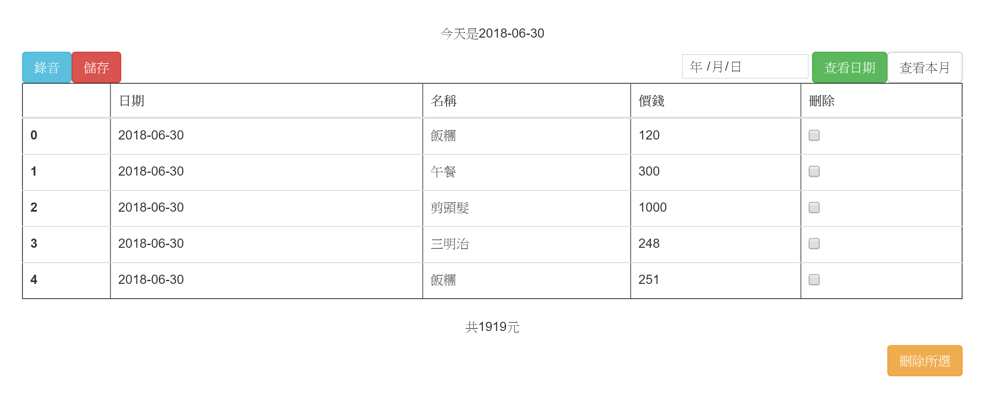

# bookkeeping (記帳)

這是一個記帳用應用程式，可以用語音輸入帳目以及金額，它會在螢幕上顯示結果。

範例：

# 安裝

1. Clone這個資料夾，並安裝所需資料包(以後會詳細列出)。
2. 根據[Google Cloud Speech API](https://github.com/GoogleCloudPlatform/python-docs-samples/tree/master/speech/cloud-client)，申請一個google帳號，並啟用Cloud Speech API。他會要你產生一組`.json`密鑰，請將這個密鑰檔保存好。
3. 更改`bookkeeping.py`中`os.environ['GOOGLE_APPLICATION_CREDENTIALS']`的值，把它設成剛才下載的密鑰路徑。

# 使用方法

1. 進入本資料夾，在命令行中輸入`python bookkeeping.py`。這會啟動應用程式，開啟網頁連至`localhost:5000`即可看見。
2. 按左上角「錄音」即可以語音輸入記帳。格式為「OOOXX元」，例如「蘋果50元」。可連續說。當google認為你說完一句話時，螢幕會顯示他辨識出的內容。須注意的是，每次錄音時間最多65秒，多了會出錯(google本身的設定)。以後可能會修正。
3. 按左上角「儲存」可儲存當前`.csv`檔為`data.csv`。(若不儲存，則關掉開啟伺服器的命令行時所有資料將會消失)

4. 其他功能應該很容易理解，懶得寫。
